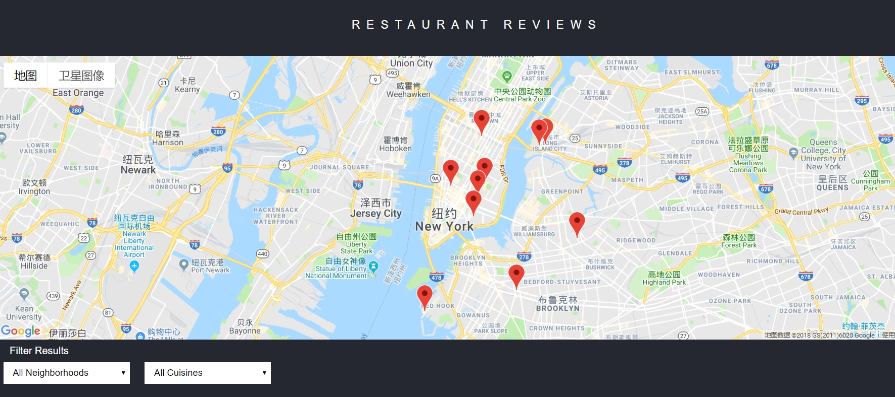
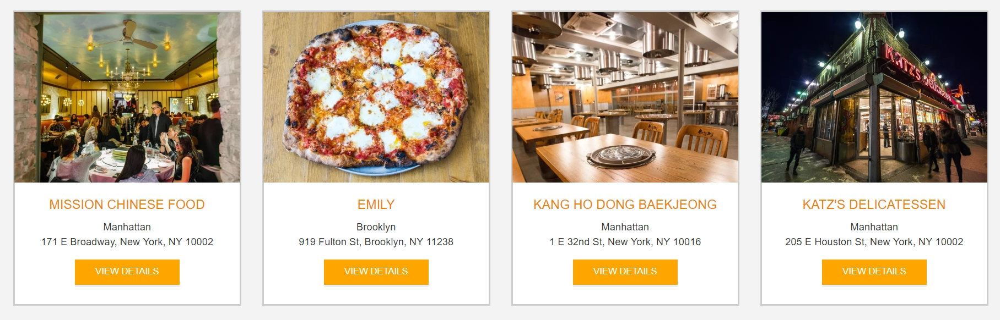

Restaurant Reviews App
===============================

<div  align="left">

<div  align="left">

</div>

# Table of Contents

* [Description](#description)
* [Requirements](#Requirements)
* [Run the Application](#run-the-application)


## Description
- In this projects, I will incrementally convert a static webpage to a mobile-ready web application. I took a static design that lacked accessibility and converted the design to be responsive on different sized displays and accessible for screen reader use. I also added a service worker to begin the process of creating a seamless offline experience for the users.

- Project created as part of the Udacity Front-End Developer Nanodegree.

## Requirements
- Make the provided site fully responsive. All of the page elements should be usable and visible in any viewport, including desktop, tablet, and mobile displays. Images shouldn't overlap, and page elements should wrap when the viewport is too small to display them side by side.

- Make the site accessible. Using what you've learned about web accessibility, ensure that alt attributes are present and descriptive for images. Add screen-reader-only attributes when appropriate to add useful supplementary text. Use semantic markup where possible, and aria attributes when semantic markup is not feasible.

- Cache the static site for offline use. Using Cache API and a ServiceWorker, cache the data for the website so that any page (including images) that has been visited is accessible offline.

## Run the Application

In order to run the application you can:

* Direct open live Demo: https://moonfallmaple.github.io/restaurant-review/

**Or run it on your computer**
* Download as .zip file
* Clone or fork this project:

    ```
    $ git clone https://github.com/moonfallmaple/restaurant-review.git
    ```
* After that run simple http server locally:

1. In this folder, start up a simple HTTP server to serve up the site files on your local computer. Python has some simple tools to do this, and you don't even need to know Python. For most people, it's already installed on your computer.

* For **Non**-Windows user input:

    Python 2.x
    ```
    python -m SimpleHTTPServer 8000
    ```

    Python 3.x
    ```
    python3 -m http.server 8000 
    ```

* For Windows user input 
    ```
    python -m http.server 8000 
    ```

* If you don't have Python installed, navigate to Python's [website](https://www.python.org/) to download and install the software.

2. With your server running, visit the site: `http://localhost:8000`, and look around for a bit to see what the current experience looks like.


